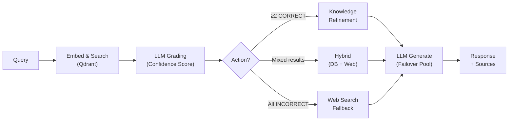

# BDU Chatbot RAG — Intelligent Admission Consulting System

[](https://www.python.org/)
[](https://fastapi.tiangolo.com/)
[](https://streamlit.io/)
[](https://qdrant.tech/)
[](LICENSE)

> **Graduation Project** — Nguyễn Bá Trưởng · Binh Duong University

Production-ready AI chatbot built with **Corrective RAG (CRAG)** architecture — automatically evaluates, corrects, and refines retrieval results before generating LLM responses. Features multi-model failover, query decomposition, and REST API for external integration.

---

## Key Technical Highlights

| Capability | Implementation |
|---|---|
| **RAG Backend** | End-to-end pipeline: Chunking → Embedding → Vector Store → Retrieval → Generation |
| **CRAG (Corrective RAG)** | LLM-based relevance grading with 3-tier correction: Knowledge Refinement / Hybrid / Web Search |
| **LLM Integration** | Groq API (LLaMA 3.3 70B) with multi-model failover pool & response caching |
| **Prompt Engineering** | Task-specific prompts for generation, evaluation, decomposition, and expansion |
| **Embedding + Vector DB** | Google EmbeddingGemma-300M + Qdrant with cosine similarity search |
| **Data Pipeline** | Multi-format ingestion (PDF/DOCX/Excel/Image → Markdown → Chunk → Index) |
| **REST API** | FastAPI with Pydantic schemas, CORS, structured error handling |
| **Query Processing** | Decomposition (complex → sub-queries) + Expansion (paraphrase generation + filtering) |
| **Security** | Prompt injection detection, rate limiting, file validation, input sanitization |
| **Evaluation** | Automated benchmark system (100 questions, 82% accuracy, PASS/FAIL metrics) |
| **Logging** | Centralized structured logging with `RotatingFileHandler` |

---

## Features

| Feature | Description |
|---|---|
| **CRAG Retriever** | Auto-evaluates & self-corrects retrieval quality via LLM grading |
| **Lazy Query Expansion** | Parallel expansion triggered only when initial results are insufficient |
| **Query Decomposition** | Splits complex multi-intent questions into independent sub-queries |
| **Security Manager** | Blocks prompt injection, enforces rate limits per user |
| **Admin Dashboard** | Data management, upload documents, chat analytics |
| **REST API** | FastAPI endpoints for external system integration |
| **Response Cache** | MD5-based LLM response caching to reduce latency |
| **LLM Failover** | Automatic fallback across model pool on failure |

---

## CRAG Pipeline Flow



---

## Tech Stack

| Component | Technology |
|---|---|
| **API Server** | FastAPI + Uvicorn |
| **Frontend** | Streamlit |
| **LLM** | Groq API (LLaMA 3.3 70B, GPT-OSS 120B) |
| **Embedding** | Google EmbeddingGemma-300M (768 dims) |
| **Vector DB** | Qdrant (embedded mode, Cosine similarity) |
| **Text Splitting** | LangChain `RecursiveCharacterTextSplitter` |
| **Document Parsing** | PyMuPDF (PDF), python-docx, Pandas (Excel) |
| **Database** | SQLite (chat history, document management) |
| **Security** | Custom SecurityManager (regex-based injection detection) |
| **Logging** | Python `logging` + `RotatingFileHandler` |

---

## Project Structure

```
Chatbot_Crag/
├── api/                              # REST API layer
│   ├── __init__.py
│   ├── main.py                       # FastAPI app (lifespan, CORS, endpoints)
│   └── schemas.py                    # Pydantic request/response models
├── app/                              # Frontend
│   ├── streamlit_app.py              # Chat UI with session management
│   └── admin_page.py                 # Admin dashboard (stats, upload, manage)
├── src/                              # Core logic
│   ├── pipeline.py                   # Main RAG pipeline orchestrator
│   ├── config.py                     # Centralized configuration
│   ├── database.py                   # SQLite data layer
│   ├── logger.py                     # Structured logging setup
│   ├── admin_backend.py              # Admin operations backend
│   ├── retrieval/
│   │   ├── crag_retriever.py         # CRAG: retrieve → evaluate → correct
│   │   ├── relevance_evaluator.py    # LLM-based relevance grading
│   │   ├── multi_query_retriever.py  # Multi-query merge & dedup
│   │   ├── cross_encoder_reranker.py # Cross-encoder reranking
│   │   └── web_search_corrector.py   # Google CSE fallback
│   ├── generation/
│   │   └── groq_llm.py              # LLM wrapper (failover + cache)
│   ├── embedding/
│   │   └── indexer.py               # Qdrant vector indexer
│   ├── Advanced_Query/
│   │   ├── query_decomposer.py      # Multi-intent decomposition
│   │   └── query_expander.py        # Paraphrase expansion + filtering
│   └── security/
│       └── security.py              # Injection detection & rate limiting
├── data/
│   ├── chunks.jsonl                  # Pre-chunked knowledge base
│   └── vietnamese-stopwords.txt      # Vietnamese NLP stopwords
├── logs/                             # Auto-generated log files
├── qdrant_data/                      # Vector database storage
├── benchmark_simple.py               # Automated evaluation script (PASS/FAIL)
├── benchmark_questions.txt           # 100 test questions
├── qdrant_setup.py                   # Vector DB initialization script
├── .env.example                      # Environment variables template
├── requirements.txt
└── README.md
```

---

## Getting Started

### Prerequisites
- Python 3.10+
- RAM: 8GB+

### 1. Clone & Setup

```bash
git clone https://github.com/galabo101/Chatbot_Crag.git
cd Chatbot_Crag

python -m venv venv
venv\Scripts\activate        # Windows
# source venv/bin/activate   # Linux/Mac

pip install -r requirements.txt
```

### 2. Configuration

```bash
cp .env.example .env
# Fill in your API keys
```

| Variable | Required | Description |
|---|---|---|
| `GROQ_API_KEY` | ✅ | API key from [Groq Console](https://console.groq.com/) |
| `GOOGLE_API_KEY` | ❌ | For web search fallback |
| `GOOGLE_CSE_ID` | ❌ | Custom Search Engine ID |

### 3. Run

**Streamlit UI** (chat interface):
```bash
streamlit run app/streamlit_app.py
# → http://localhost:8501
```

**FastAPI** (REST API):
```bash
uvicorn api.main:app --reload --port 8000
# → http://localhost:8000/docs (Swagger UI)
```

---

## API Reference

### `POST /chat`

Send an admission consulting question.

**Request:**
```json
{
  "query": "Học phí ngành Công nghệ thông tin là bao nhiêu?",
  "user_id": "user_123"
}
```

**Response:**
```json
{
  "query": "Học phí ngành Công nghệ thông tin là bao nhiêu?",
  "answer": "Học phí ngành CNTT tại BDU năm 2025 là...",
  "sources": [
    {
      "chunk_id": "hoc-phi-2025_chunk_1",
      "url": "https://bdu.edu.vn/hoc-phi",
      "title": "Học phí năm 2025",
      "score": 0.92,
      "type": "text"
    }
  ],
  "num_sources": 1,
  "timing": {
    "decomposition": 0.15,
    "retrieval": 1.23,
    "generation": 2.45,
    "total": 3.83
  },
  "model_type": "gemma"
}
```

### `GET /health`

System health check with component status.

```json
{
  "status": "healthy",
  "version": "1.0.0",
  "components": {
    "pipeline": "ready",
    "qdrant": "connected",
    "llm": "available"
  },
  "uptime_seconds": 3600.5
}
```

> Full interactive docs at **Swagger UI**: `http://localhost:8000/docs`

---

## Benchmark Results

Automated evaluation on 100 real admission questions:

| Result | Count | Rate |
|---|---|---|
| PASS | 82 | 82% |
| FAIL (Missing data) | 15 | 15% |
| FAIL (Wrong answer) | 3 | 3% |
| **Total** | **100** | **100%** |

**Accuracy: 82%** · True error rate: 3% · Avg response time: ~3.8s

---

## Author

**Nguyễn Bá Trưởng**
- Student ID: 18050082
- Email: 18050082@student.bdu.edu.vn
- Binh Duong University

## License

MIT License — See [LICENSE](LICENSE) for details.
